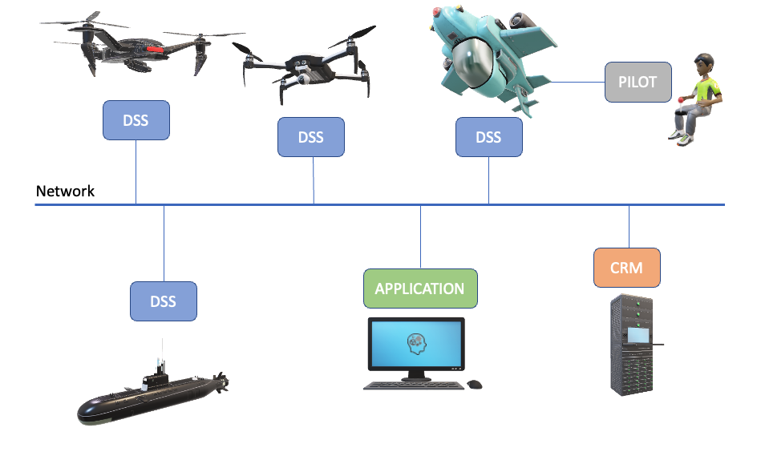

.. |DSS| replace:: Drone Safety System
.. |CRM| replace:: Central Resource Manager

.. role:: python(code)
  :language: python

.. _dssapi:

Drone Safety System API
========================

.. index:: DSS, Drone Safety System

The |DSS| acts as a safety bridge towards the communication with the
drone autopilot and offers applications to connect and control a drone
via a unified API. The |DSS| currently supports Ardupilot and DJI
autopilot software, and the system is supposed to be agnostic to
autopilot - an application developed for Ardupilot should be able to
run with the DJI autopilot without (major) updates in the application
code.

The |DSS| takes care of the low level functionality. An application
software connects to the |DSS| and executes custom made missions.
Applications can be written in any language and be hosted anywhere on
the network. The communication library ZeroMQ is used to share
information between entities independent on architecture and code
base.

The controls of the drone can be handled by the PILOT, the APPLICATION
or the DSS itself. The safety pilot gives the controls to the
application when the drone is set up. If the application disconnects
or loses link, the DSS will take the controls. The safety pilot can at
any given time take the controls back from both DSS and APPLICATION.
When the application is not in controls the application is prohibited
to controlling the drone, but it can still acquire information and
upload missions for future execution. If a DSS function is unavailable
when an application is not in controls, the application will receive a
NACK response from the DSS. This is described in more detail in the
API specification later on in this chapter.

The final component in the figure below is the Central Resource
Manager (CRM). The CRM is mainly responsible for managing the
available drone resources to applications. However, it can also launch
a new application to control the drone if the previous application
owner for some reason loses connection to the drone during flight.
Nowdays we strive to use the CRM for all applications and scenarios.
It is the default option, however it is still possible to run
applications without the CRM if they are developed to support it.

  Drone software platform architecture overview

Communication
--------------

.. index:: DSS, Communication

The |DSS| offers three external interfaces towards an application. To
support any code base in the application, commands are encoded in
serialised JSON objects and transferred via zeroMQ library.

- DSS Ctrl Reply-socket where the application can call functions and
  receive ack/nack and information

- Info Publish-socket where data streams can be published, e.g.
  autopilot state data

- Data Publish-socket for bigger data structures, e.g. photos

Available commands are described in :ref:`dsscontrolAPI`.

The socket ports for non CRM operations are described below. In CRM
operations the CRM will present the ip and Ctrl-Reply-socket port for
each client, and the publish ports can be requested by directly
connecting to the client of interest and issuing get_info. The sockets
are open for all connecting ip-numbers.

.. code-block:: json
  :caption: Sockets port definition if **NOT** using CRM
  :linenos:

  {
    "Ctrl-Reply-socket": 5557,
    "Info-Publish-Socket": 5558,
    "Data-Publish-Socket": 5559
  }

Each function call must include an application id. This is because
each DSS is owned by someone (application id), and that the owner has
higher level permissions than non-owners. Some commands requires that
the command is sent from the dss owner in order to be acknowledged by
the DSS, while some commands can be used by everyone. This is
explained in more detail in the Nack reasons for each command in the
API.

In scenarios where CRM is used the application id is distributed by
the CRM in the setup phase. In scenarios without CRM, the application
must use the default application id :python:`"da000"`.

.. _coordinatesystems:

Coordinate systems
------------------

The |DSS| handles three coordinate systems, LLA, NED and XYZ. The are
defined in this section.

.. _LLAcoordinatesystem:

LLA coordinate system
~~~~~~~~~~~~~~~~~~~~~

The LLA coordinate system is global and stands for Latitude,
Longitude, Altitude.

**Units:**
  - Latitude, Longitude [decimal degrees]
  - Alt [m AMSL]
  - Heading [deg relative true north]

.. _NEDcoordinatesystem:

NED coordinate system
~~~~~~~~~~~~~~~~~~~~~

The NED coordinate system is local and stands for North, East, Down.
The coordinate system is relative to the init point, refer to function
:ref:`fcnsetinitpoint`.

**Units:**
  - North, East, Down [m relative init point]
  - Heading [deg relative true north]

.. _XYZcoordinatesystem:

XYZ coordinate system
~~~~~~~~~~~~~~~~~~~~~

The XYZ coordinate system is local and is relative to the init point,
refer to function :ref:`fcnsetinitpoint`. The orientation of the
coordinate system depends on the camera heading (or drone heading if a
camera is not used) when init is called. X maps is defined in the
camera heading, Y 90 degrees right and Z downwards.

.. topic:: Example

  The drone is placed on ground, with heading 80 deg relaitve true
  north, and the camera camera heading is rotated 10 deg relative to
  the drone, .i.e. pointing 90 deg relative true north. The init
  function :ref:`fcnsetinitpoint` is called and the XYZ coordinate
  system is set. X is now defined as East, Y as South and Z downwards.

**Units:**
  - X, Y, Z [m relative init point in XYZ system]
  - Heading [deg relative X-axis definition, around Z-axis]

.. _geofence:

Geo fence
~~~~~~~~~

The |DSS| implements a geo fence as a low height limit, a high height
limit and a radius relative to the init point, :ref:`fcnsetinitpoint`.
The low height limit is only used for checking missions that are
uploaded.

Geo fence parameters can be changed, refer to function
:ref:`fcnsetgeofence`.

Missions are checked towards the geo fence when uploaded, missions
violating the geofence are rejected.

.. If the drone is flown into a geo fence it will stop and hover (low height geo fence exempted).

.. _dsscontrolAPI:

DSS Ctrl-link API
-----------------

.. index:: DSS; Ctrl-link API

General
~~~~~~~

The ZeroMQ REQ/REP interface takes function calls as JSON objects with
two mandatory keys, :python:`"fcn"` and :python:`"id"`, the string
values are the function name and the application id. Additional keys
are described in this API chapter. Each function call gets confirmed
with an ack or a nack where the key :python:`"call"` holds the name of
the calling function. A generic example follows:

.. code-block:: json
  :caption: Generic function call from application to |DSS|
  :linenos:

  {
    "fcn": "<function name>", "id": "<requestor id>"
  }

Response from |DSS| is an ack or a nack. The key :python:`"call"`
carries the name of the function called. Some functions uses the ack
reply to transfer data, which can be seen in the listings of the API
below. A nack includes the key :python:`"description"` that carries a
nack description string.

.. code-block:: json
  :caption: Generic response: ``ack``
  :linenos:

  {
    "fcn": "ack",
    "call": "<function_name>"
  }

.. code-block:: json
  :caption: Generic response: ``nack``
  :linenos:

  {
    "fcn": "nack",
    "call": "<function name>",
    "description": "<Nack reason>"
  }

Fcn: ``heart_beat``
~~~~~~~~~~~~~~~~~~~

.. compatibility:: badge
  :ardupilot: -
  :dji: verified
  :py-client: verified

The |DSS| tracks the activity from the application to survey if the
application is still alive. Each and every function call from
the application to the |DSS| acts as a heartbeat. If no other messages
are sent from the application to the |DSS|, the application shall call
the ``heart_beat`` function to maintain the link integrity. The link
is considered degraded after 5 seconds and lost after 10 seconds.

The link lost behaviour differs depending on if the |CRM| is used or not as
described below.

|CRM| not used behaviour:
_________________________

The |DSS| will engage the autopilot implementation of the Return To
Launch (RTL) command.

|CRM| is used behaviour:
_________________________

The |DSS| will notify the CRM using the function `app_lost`. If it
receives an ack, the |DSS| will reset the lost link counter. In the
meantime the |CRM| will launch an application that claims ownership of
the |DSS| and will send heart beats. If the lost link counter reaches
the limit for the second time without receiving any heartbeats in
between the |DSS| will engage the autopilot implementation of RTL.

If it receives a nack (or no response) |DSS| will engage the autopilot
implementation of RTL.

.. code-block:: json
  :caption: Function call ``heart_beat``
  :linenos:

  {
    "fcn": "heart_beat",
    "id": "<requestor id>"
  }

The DSS responds to the ``heart_beat`` function call with an ack.

.. code-block:: json
  :caption: Response to ``heart_beat``
  :linenos:

  {
    "fcn": "ack",
    "call": "heart_beat"
  }

**Nack reasons:**
  - Requester (``id``) is not the DSS owner

  .. _fcngetinfo:

Fcn: get_info
~~~~~~~~~~~~~

The function ``get_info`` requests connection information from the DSS.
The DSS answers with an ack and the applicable information.

.. code-block:: json
  :caption: Function call: ``get_info``
  :linenos:

  {
    "fcn": "get_info",
    "id": "<requestor id>"
  }

.. code-block:: json
  :caption: Reply: ``get_info``
  :linenos:

  {
    "fcn": "ack",
    "call": "get_info",
    "id": "<replier id>",
    "info_pub_port": 1234,
    "data_pub_port": 5678
  }

**Nack reasons:**
  - None

.. _whocontrols:

Fcn: ``who_controls``
~~~~~~~~~~~~~~~~~~~~~

.. compatibility:: badge
  :ardupilot: -
  :dji: verified
  :py-client: verified

The function ``who_controls`` requests who is in control of the drone,
the "APPLICATION" (drone application) the "PILOT" (pilot in command)
or the "DSS" itself. While the pilot is in control the |DSS| is not
allowed to control the drone. This is a safety feature.

The response holds the key "in_controls" that carries the string
"PILOT", "APPLICATION" or "DSS". CRM is treated as an application.

.. todo:: Should operator == PILOT be a nack reason for all commands affecting the drone?

.. code-block:: json
  :caption: Function call: ``who_controls``
  :linenos:

  {
    "fcn": "who_controls",
    "id": "<requestor id>",
  }

.. code-block:: json
  :caption: Function response:
  :linenos:

  {
    "fcn": "ack",
    "call": "who_controls",
    "in_controls": "APPLICATION"
  }

**Nack reasons:**
  - None

.. _getowner:

Fcn: ``get_owner``
~~~~~~~~~~~~~~~~~~~~~

.. compatibility:: badge
  :ardupilot: -
  :dji: implemented
  :py-client: -

The function ``get_owner`` requests the registered owner of the DSS.

The response holds the key "owner" that carries the string with the
application id of the owner. The default owner is "da000".

.. code-block:: json
  :caption: Function call: ``get_owner``
  :linenos:

  {
    "fcn": "get_owner",
    "id": "<requestor id>",
  }

.. code-block:: json
  :caption: Function response:
  :linenos:

  {
    "fcn": "ack",
    "call": "get_owner",
    "owner": "<owner id>"
  }

**Nack reasons:**
  - None

.. _fcnsetowner:

Fcn: ``set_owner``
~~~~~~~~~~~~~~~~~~~~~

.. compatibility:: badge
  :ardupilot: -
  :dji: implemented
  :py-client: -

The function ``set_owner`` sets the DSS owner. The function call holds
the key "owner" with a string with the new owners id. The reply holds
an ack or a nack.

.. code-block:: json
  :caption: Function call: ``set_owner``
  :linenos:

  {
    "fcn": "set_owner",
    "id": "<requestor id>",
    "owner": "<the new owner>"
  }

**Nack reasons:**
  - Requestor is not CRM

.. _fcnsetgeofence:

Fcn: ``set_geofence``
~~~~~~~~~~~~~~~~~~~~~

.. compatibility:: badge
  :ardupilot: -
  :dji: implemented

The function ``set_geofence`` sets the geo fence. The message takes
doubles for the keys "height_low", "height_high" and "radius", the unit
is meters. The geo fence is evaluated relative the start position,
refer to section :ref:`geofence`.

Geofence default settings: Low height 2m, high height 50m, radius 50m.

.. code-block:: json
  :caption: Function call: ``set_geofence``
  :linenos:

  {
    "fcn": "set_geofence",
    "id": "<requestor id>",
    "height_low": 2,
    "height_high": 50,
    "radius": 50
  }

**Nack reasons:**
  - Requester (``id``) is not the DSS owner

.. _getidle:

Fcn: ``get_idle``
~~~~~~~~~~~~~~~~~

.. compatibility:: badge
  :ardupilot: -
  :dji: verified
  :py-client: verified

The function ``get_idle`` reports false if task is running, i.e. take-off, fly
waypoints or landing for example, otherwise true. Can be used for awaiting
take-off to complete for example

.. code-block:: json
  :caption: Function call: ``get_idle``
  :linenos:

  {
    "fcn": "get_idle",
    "id": "<requestor id>"
  }

.. code-block:: json
  :caption: Function response:
  :linenos:

  {
    "fcn": "ack",
    "idle": true
  }

**Nack reasons:**
  - None

.. _fcngetstate:

Fcn: ``get_state``
~~~~~~~~~~~~~~~~~~
.. compatibility:: badge
  :ardupilot: -
  :dji: verified
  :py-client: verified

The function get state acquires one instance of the STATE-message that also can
be subscribed to as a data-stream.

Lat, long [Decimal degrees]; Alt [m AMSL]; Heading [degrees relative true
north]; Agl [m] above ground, -1 if not valid; . vel_n, vel_e, vel_d [m/s] in
NED frame and gnss_state [0-6] with mapping described below, key 'flight_state'
reports a state machine that is initiated 'ground', after take off flight_state
will and then toggle between 'flying' and 'landed' (ground -> flying <-> landed)

.. code-block:: json
  :caption: Function call: ``get_state``
  :linenos:

  {
    "fcn": "get_state",
    "id": "<requestor id>"
  }

.. code-block:: json
  :caption: Function call: ``get_state``
  :linenos:

  {
    "fcn": "ack",
    "lat": -0.0018926148768514395,
    "long": 0.0014366497052833438,
    "alt": 28.3,
    "heading": 359,
    "agl": -1,
    "vel_n": 2.2,
    "vel_e": 0,
    "vel_d": -1.1,
    "gnss_state": 3,
    "flight_state": "landed"
  }

**Nack reasons:**
  - None

.. _fcnsetinitpoint:

Fcn: ``set_init_point``
~~~~~~~~~~~~~~~~~~~~~~~~

.. compatibility:: badge
  :ardupilot: -
  :dji: verified
  :py-client: verified

The function ``set_init_point`` saves the current position and heading
as a reference for the local coordinate systems NED and XYZ. Refer to
coordinate system definitions :ref:`coordinatesystems`. The message
contains a key ``heading_ref`` defining how the the X-axis should be
defined. Set heading_ref to "drone" for using current drone heading as
reference or "camera" to use current camera heading as reference. It
is recommended to let the position stabilize before calling this function.
The init point is fixed, it can only be set once be changed.

.. note:: The |DSS| prohibits take-off if the init point is not set. However, if the drone is controlled by PILOT, the DSS will issue ``set_init_point`` with key "heading_ref" set to "drone" when the take-off command is executed.

.. code-block:: json
  :caption: Function call: ``set_init_point``
  :linenos:

  {
    "fcn": "set_init_point",
    "id": "<requestor id>",
    "heading_ref": "camera"
  }

**Nack reasons:**
  - Requester (``id``) is not the DSS owner
  - Navigation not ready
  - Init point already set
  - Gimbal yaw not readable

.. _fcnresetdsssrtl:

Fcn: ``reset_dss_srtl``
~~~~~~~~~~~~~~~~~~~~~~~

.. compatibility:: badge
  :ardupilot: -
  :dji: verified
  :py-client: verified

The function ``reset_dss_srtl`` resets the DSS SRTL stack and takes
the current postion as the final position for the DSS SRTL mission.
Hence, the drone will engage landing from this point. The drone must
have a safe altitude when the command is issued, otherwise the
approach will not be safe. If the current altitude is lower than 2m,
the altitude will be set to 2m.

.. code-block:: json
  :caption: Function call: ``reset_dss_srtl``
  :linenos:

  {
    "fcn": "reset_dss_srtl",
    "id": "<requestor id>"
  }

**Nack reasons:**
  - Requester (``id``) is not the DSS owner
  - Navigation not ready

.. _fcnarmtakeoff:

Fcn: ``arm_take_off``
~~~~~~~~~~~~~~~~~~~~~

.. compatibility:: badge
  :ardupilot: -
  :dji: verified
  :py-client: verified

The function ``arm_take_off`` arms the vehicle if possible and
executes a takeoff command to the height specified in key ``height``
[m]. The function does not report when take-off is completed,
application must monitor the altitude until target height is reached.
The height is relative to current position (ground) and height
argument must be between 2m and 40m. When the drone reaches the target
height, the corresponding position will be added as the first waypoint
in the list of waypoints used by the DSS SRTL, i.e. the last waypoint
to visit,.

.. code-block:: json
  :caption: Function call: ``arm_take_off``
  :linenos:

  {
    "fcn": "arm_take_off",
    "id": "<requestor id>",
    "height": 10
  }

**Nack reasons:**
  - Requester (``id``) is not the DSS owner
  - Application is not in controls
  - Less than 8 satellites
  - State is flying
  - Height is out of limits
  - Init point not set

.. _fcnland:

Fcn: ``land``
~~~~~~~~~~~~~

.. compatibility:: badge
  :ardupilot: -
  :dji: verified
  :py-client: verified

The function land commands the drone to stop and land. The function
will not report when landing is completed. The application can monitor
the landing complete by calling :ref:`getarmed`.

.. code-block:: json
  :caption: Function call: ``land``
  :linenos:

  {
    "fcn": "land",
    "id": "<requestor id>"
  }

**Nack reasons:**
  - Requester is not the DSS owner
  - Application is not in controls
  - Not flying

.. _fcnrtl:

Fcn: ``rtl``
~~~~~~~~~~~~

.. compatibility:: badge
  :ardupilot: -
  :dji: verified
  :py-client: verified

The function rtl commands the drone to engage the autopilot
implementation of RTL.

.. code-block:: json
  :caption: Function call: ``rtl``
  :linenos:

  {
    "fcn": "rtl",
    "id": "<requestor id>"
  }

**Nack reasons:**
  - Requester is not the DSS owner
  - Application is not in controls
  - Not flying
  - RTL failed to engage, try again

.. _fcndsssrtl:

Fcn: ``dss_srtl``
~~~~~~~~~~~~~~~~~

.. compatibility:: badge
  :ardupilot: -
  :dji: verified
  :py-client: verified

The function ``dss_srtl`` commands the drone to engage the DSS Smart
RTL Mission. Each tracked waypoint is added to the DSS smart RTL list.
When this function is called, the waypoints in the smart RTL list will
be visited in reverse order and the drone will finally reach the
recovery location, i.e. the position where :ref:`fcnresetdsssrtl` was
last called. At the recovery location the drone will hover the time
specified as an integer in key ``hover_time`` [s], then proceed with
landing and disarming. Valid range for hover time is 0-300s.

.. code-block:: json
  :caption: Function call: ``dss_srtl``
  :linenos:

  {
    "fcn": "dss_srtl",
    "id": "<requestor id>",
    "hover_time": 5
  }

**Nack reasons:**
  - Requester is not the DSS owner
  - Application is not in controls
  - Not flying
  - Hover_time is out of limits

.. _fcnsetvelbody:

Fcn: ``set_vel_BODY``
~~~~~~~~~~~~~~~~~~~~~

.. compatibility:: badge
  :ardupilot: -
  :dji: verified
  :py-client: verified

The function ``set_vel_BODY`` sets the application desired body fixed
velocities for 2 seconds. If no new commands are sent within 2 seconds
the drone will stop and hover. The drone coordinate system is defined
such that `x` points forwards, `y` points to the right and `z` points
downwards. Velocities are given as a double and set in [m/s] and
``yaw_rate`` as a double in [deg/s]. The |DSS| analyses and follows
the desired velocities when appropriate, while ensuring safe
operations of the drone.

.. note:: Positive z values corresponds to a descent.

.. code-block:: json
  :caption: Function call: ``set_vel_BODY``
  :linenos:

  {
    "fcn": "set_vel_BODY",
    "id": "<requestor id>",
    "x": 0,
    "y": 0,
    "z": 0,
    "yaw_rate": 0
  }

**Nack reasons:**
  - Requester is not the DSS owner
  - Application is not in controls
  - Not flying

.. _setheading:

Fcn: ``set_heading``
~~~~~~~~~~~~~~~~~~~~

.. compatibility:: badge
  :ardupilot: -
  :dji: verified
  :py-client: verified

The function ``set_heading`` sets the application desired heading
specified as a double in the key ``heading`` [deg] relative to true
north. Valid range is [0-360[. This action is implemented by sending a
waypoint to the autopilot at the current location with the specified
heading.

.. code-block:: json
  :caption: Function call: ``set_heading``
  :linenos:

  {
    "fcn": "set_heading",
    "id": "<requestor id>",
    "heading": 0
  }

**Nack reasons:**
  - Requester is not the DSS owner
  - Application is not in controls
  - Not flying
  - Heading is out of limits
  - Mission is active

Fcn: ``set_alt``
~~~~~~~~~~~~~~~~

.. compatibility:: badge
  :ardupilot: -
  :dji: verified
  :py-client: verified

The function ``set_alt`` sets the application desired altitude specified as a
double in the key ``alt`` [m] with ``reference`` "init" or "AMSL". Altitude must
be at least 2m higher than take-off location. This action is implemented by
sending a waypoint to the autopilot at the current location with the specified
altitude.

.. code-block:: json
  :caption: Function call: ``set_alt``
  :linenos:

  {
    "fcn": "set_alt",
    "id": "<requestor id>",
    "alt": 30,
    "reference": "init"
  }

**Nack reasons:**
  - Requester is not the DSS owner
  - Application is not in controls
  - Not flying
  - Alt is out of limits
  - Mission is active

.. _fcnsetdefaultspeed:

Fcn: ``set_default_speed``
~~~~~~~~~~~~~~~~~~~~~~~~~~

.. compatibility:: badge
  :ardupilot: -
  :dji: -

The function ``set_default_speed`` sets the default speed according to
the value of the key ``default_speed`` [m/s]. The |DSS| will apply the
default speed if the optional argument ``speed`` is missing in a
mission.

.. code-block:: json
  :caption: Function call: ``set_default_speed``
  :linenos:

  {
    "fcn": "set_default_speed",
    "id": "<requestor id>",
    "default_speed": 0
  }

**Nack reasons:**
  - Requester is not the DSS owner
  - Default speed is out of DSS limits

.. _fcnupload_mission_LLA:

Fcn: ``upload_mission_LLA``
~~~~~~~~~~~~~~~~~~~~~~~~~~~

.. compatibility:: badge
  :ardupilot: -
  :dji: verified
  :py-client: verified

The function ``upload_mission_LLA`` uploads a sequence of waypoints
given in the LLA coordinate system - degrees latitude, longitude and
meters altitude AMSL (above mean sea level). The uploaded mission is
stored as a pending mission, and any current pending mission is
overwritten. (independent on reference frame LLA/NED/XYZ).

Each waypoint has an incremental id depending on the waypoint's
position in the waypoint list. First waypoint has id 0, second has id
1 etc. If a mission does not fulfil this criteria it will be rejected.

A minimal mission consists of 1 wp, maximum number of waypoints is not
limited but not tested.

The heading of the vehicle is specified in the key ``heading`` [deg]
relative to true north, valid range is [0-360[. Alternatively, the
``heading`` can be set to the string ``"course"`` to have the drone
pointing to the waypoint as it approaches. Course is calculated as the
bearing from the current position to the target position.

The key ``action`` is optional and supports take_photo and the
additional optional key ``gimbal_pitch``.

The key ``speed`` is optional, if excluded vehicle will use the
default speed set in function :ref:`fcnsetdefaultspeed`.

A mission can be uploaded at any time, even if a mission is already
under execution. The uploaded mission is activated by calling
:ref:`fcngogo`.

.. code-block:: json
  :caption: Function call: ``upload_mission_LLA``
  :linenos:

  {
    "fcn": "upload_mission_LLA",
    "id": "<requestor id>",
    "mission": {
      "id0": {
        "lat": 59.81138609219151,
        "lon": 17.654357714443147,
        "alt": 58,
        "heading": "course",
        "speed": 5,
        "action": "take_photo",
        "gimbal_pitch": -45
      },
      "id1": {
        "lat": 59.81194802311458,
        "lon": 17.65435771534038,
        "alt": 59,
        "heading": 180
      }
    }
  }

**Nack reasons:**
  - Requester is not the DSS owner
  - Init point is not set
  - Geofence violation, <wp id>
  - Wp numbering faulty, missing <wp id>
  - WP action not supported, <wp id>
  - Speed below 0.1, <wp id>
  - Heading faulty, <wp id>

.. _fcnupload_mission_NED:

Fcn: ``upload_mission_NED``
~~~~~~~~~~~~~~~~~~~~~~~~~~~

.. compatibility:: badge
  :ardupilot: -
  :dji: verified
  :py-client: verified

The function ``upload_mission_NED`` uploads a sequence of waypoints given
in the NED coordinate system - meters North, East, Down relative to
the point of init, refer to :ref:`fcnsetinitpoint`. The uploaded
mission is stored the a pending mission any current pending mission is
overwritten (independent on reference frame LLA/NED/XYZ).

Each waypoint has an incremental id depending on the waypoint's
position in the waypoint list. First waypoint has id 0, second has id
1 etc. If a mission does not fulfil this criteria it will be
rejected.

A minimal mission consists of 1 wp, maximum number of waypoints is not
limited but not tested yet.

The heading of the vehicle is specified in the key ``heading`` [deg]
relative to true north, valid range is [0-360[. Alternatively, the
``heading`` can be set to the string ``"course"`` to have the drone
pointing to the waypoint as it approaches. Course is calculated as the
bearing from the current position to the target position.

The key ``action`` is optional and supports take_photo and the
additional optional key ``gimbal_pitch``.

The key ``speed`` is optional, if excluded vehicle will use the
default speed set in function :ref:`fcnsetdefaultspeed`.

A mission can be uploaded at any time, even if a mission is already
under execution. The uploaded mission is activated by calling
:ref:`fcngogo`.

.. code-block:: json
  :caption: Function call: ``upload_mission_NED``
  :linenos:

  {
    "fcn": "upload_mission_NED",
    "id": "<requestor id>",
    "mission": {
      "id0": {
        "north": 20,
        "east": 30,
        "down": -15,
        "heading": "course",
        "action": "take_photo",
        "gimbal_pitch": -45
      },
      "id1": {
        "north": 20,
        "east": -20,
        "down": -20,
        "heading": 20,
        "speed": 1
      }
    }
  }

**Nack reasons:**
  - Requester is not the DSS owner
  - Init point is not set
  - Geofence violation, <wp id>
  - Wp numbering faulty, missing <wp id>
  - WP action not supported, <wp id>
  - Speed below 0.1, <wp id>
  - Heading faulty, <wp id>

.. _fcnupload_mission_XYZ:

Fcn: ``upload_mission_XYZ``
~~~~~~~~~~~~~~~~~~~~~~~~~~~

.. compatibility:: badge
  :ardupilot: -
  :dji: verified
  :py-client: verified

The function ``upload_mission_XYZ`` uploads a sequence of waypoints
given in the XYZ coordinate system - meters X, Y and Z relative to the
coordinate system origin defined by calling the init function, refer
to :ref:`fcnsetinitpoint`. The uploaded mission is stored the a
pending mission any current pending mission is overwritten
(independent on reference frame LLA/NED/XYZ).

Each waypoint has an incremental id depending on the waypoint's
position in the waypoint list. First waypoint has id 0, second has id
1 etc. If a mission does not fulfill this criteria it will be
rejected.

A minimal mission consists of 1 wp, maximum number of waypoints is not
limited but not tested yet.

The heading of the vehicle is specified in the key ``heading`` [deg]
relative to coordinate system definition (around z-axis where the
positive x-axis defines heading 0), valid range is [0-360[.
Alternatively, the key ``heading`` can be set to the string
``"course"`` to have the drone pointing to the waypoint as it
approaches. Course is calculated as the bearing from the current
position to the target position.

The key ``action`` is optional and supports take_photo and the
additional optional key ``gimbal_pitch``.

The key ``speed`` is optional, if excluded vehicle will use the
default speed set in function :ref:`fcnsetdefaultspeed`.

A mission can be uploaded at any time, even if a mission is already
under execution. The uploaded mission is activated by calling
:ref:`fcngogo`.

.. code-block:: json
  :caption: Function call: ``upload_mission_XYZ``
  :linenos:

  {
    "fcn": "upload_mission_XYZ",
    "id": "<requestor id>",
    "mission": {
      "id0": {
        "x": 20,
        "y": 30,
        "z": -15,
        "heading": 30,
        "action": "take_photo",
        "gimbal_pitch": -45
      },
      "id1": {
        "x": 20,
        "y": -20,
        "z": -20,
        "heading": "course",
        "speed": 1,
        "action": "take_photo"
      }
    }
  }

**Nack reasons:**
  - Requester is not the DSS owner
  - Init point is not set
  - Geofence violation, <wp id>
  - Wp numbering faulty, missing <wp id>
  - WP action not supported, <wp id>
  - Speed below 0.1, <wp id>
  - Heading faulty, <wp id>

.. _fcngogo:

Fcn: ``gogo``
~~~~~~~~~~~~~~~~~

.. compatibility:: badge
  :ardupilot: -
  :dji: verified
  :py-client: verified

The function `gogo` activates a pending mission. The |DSS| will start
the mission at the waypoint number set in the key "next_wp". The drone
will stop at the last way point.

Missions executed by the mission implementation in |DSS|, not the
autopilot's mission features.

.. code-block:: json
  :caption: Function call: ``gogo``
  :linenos:

  {
    "fcn": "gogo",
    "id": "<requestor id>",
    "next_wp": 0
  }

Nack reasons:
  - Requester is not the DSS owner
  - Application is not in controls
  - Not flying
  - Wp number is not available in pending mission

.. _fcnsetpattern:

Fcn: ``set_pattern``
~~~~~~~~~~~~~~~~~~~~

.. compatibility:: badge
  :ardupilot: -
  :dji: implemented
  :py-client: implemented

The function ``set_pattern`` loads a flight pattern that can be
applied in :ref:`follow_stream`. The pattern describes how the drone
should fly in relation to a reference.

**Pattern above**

The pattern ``above`` has a key ``rel_alt`` [m] for altitude relative
to referene (positive means above reference), and key ``heading`` that
can be set relative true north ([0-360[) or ``"course"`` or ``"poi"``
for pointing at the reference position. Course is low pass filtered
such as the drone will not update its heading unless the spedd exceeds
1 meter per second.

.. code-block:: json
  :caption: Function call: ``set_pattern; above``
  :linenos:

  {
    "fcn": "set_pattern",
    "id": "<requestor id>",
    "pattern": "above",
    "rel_alt": 15,
    "heading": "course"
  }

**Nack reasons:**
  - Requester is not the DSS owner
  - Heading faulty

**Pattern circle**

The pattern ``circle`` has a key ``rel_alt`` for altitude relative to
reference (positive means above reference). The key ``radius`` [m]
determines the horizontal distance from reference.

The key ``heading`` can be set [0-360[, ``"course"``
or ``"poi"`` for pointing at the reference position.

The key "yaw_rate" [deg/s] sets the desired yaw rate. If the
combination of yaw rate and radius are too big velocity limits will
apply. In this case yaw rate will be limited and radius remain. A
positive yaw rate will result in clockwise circle pattern.

The relation between yaw_rate (:math:`r`) and radius (:math:`R`)
determines the velocity as follows: :math:`v=2 \pi rR/360`, or
approximately :math:`0.0175rR`.

.. code-block:: json
  :caption: Function call: ``set_pattern; circle``
  :linenos:

  {
    "fcn": "set_pattern",
    "id": "<requestor id>",
    "pattern": "circle",
    "rel_alt": 10,
    "radius": 10,
    "heading": "poi",
    "yaw_rate": 10
  }

**Nack reasons:**
  - Requester is not the DSS owner
  - Heading faulty

.. _follow_stream:

Fcn: ``follow_stream``
~~~~~~~~~~~~~~~~~~~~~~

.. compatibility:: badge
  :ardupilot: -
  :dji: implemented
  :py-client: implemented

The function ``follow_stream`` activates the flight mode follow stream
where the drone follows a reference position with an optional pattern
as offset, refer to :ref:`fcnsetpattern`. The stream format is described
in :ref:`LLA`. Function follow_stream has a key ``enable`` to enable
or disable the stream, a key ``ip`` and ``port`` for endpoint information to
the LLA-stream to follow. If the stream is not updated during 10
seconds DSS will stop an hover.

.. code-block:: json
  :caption: Function call: ``follow_stream``
  :linenos:

  {
    "fcn": "follow_stream",
    "id": "<requestor id>",
    "enable": true,
    "ip": "<ip of LLA stream>",
    "port": 1234
  }

**Nack reasons:**
  - Requester is not the DSS owner
  - Application is not in controls
  - Not flying
  - Pattern not set
  - Stream already enabled

.. _fcnsetgimbal:

Fcn: ``set_gimbal``
~~~~~~~~~~~~~~~~~~~

.. compatibility:: badge
  :ardupilot: -
  :dji: verified
  :py-client: verified

The function ``set_gimbal`` commands the gimbal to rotate to the
``roll``, ``pitch`` and ``yaw`` angles provided [deg]. Positive roll
is leaning right, positive pitch angles points nose up and increasing
yaw angles rotates the gimbal clockwise. Parameters not supported by
the gimbal in use will just be ignored.

.. code-block:: json
  :caption: Function call: ``set_gimbal``
  :linenos:

  {
    "fcn": "set_gimbal",
    "id": "<requestor id>"
    "roll": 0,
    "pitch": -90,
    "yaw": 0
  }

**Nack reasons:**
  - Requester is not the DSS owner
  - Application is not in controls
  - Roll, pitch or yaw is out of range for the gimbal

.. _fcnsetgripper:

Fcn: ``set_gripper``
~~~~~~~~~~~~~~~~~~~~

.. compatibility:: badge
  :ardupilot: -

The function ``set_gripper`` controls the OpenGrap EPM V3 R5C gripper.
The key ``enable`` indicates if the gripper shall be enabled or not
(True = grab, False = release). Set up the regrab setting in the
autopilot to 15s to ensure strong magnetisation and compliance with
|DSS|. Any command sent to the gripper while grabbing or releasing
will be ignored. |DSS| will send all gripper commands to the gripper
twice with a 5s delay in between to ensure message is received. If the
gripper is set up over can, the correct can_id must be sent, if set up
via PWM set CAN_ID to 0.

.. code-block:: json
  :caption: Function call: ``set_gripper``
  :linenos:

  {
    "fcn": "set_gripper",
    "id": "<requestor id>",
    "enable": true,
    "CAN_ID": 100
  }

**Nack reasons:**
  - Requester is not the DSS owner
  - Application is not in controls
  - Other action in execution

.. _fcnsetspotlight:

Fcn: ``set_spotlight``
~~~~~~~~~~~~~~~~~~~~~~

.. compatibility:: badge
  :ardupilot: -

The function ``set_spotlight`` controls the spotlight payload. The key
``enable`` indicates if the spotlight shall be enabled or not, the key
``brightness`` sets the brightness of the spotlight, valid range is [1 100],
although the brightness will be limited to 50 when on ground, function will
return ack in this case.

.. code-block:: json
  :caption: Function call: ``set_spotlight``
  :linenos:

  {
    "fcn": "set_spotlight",
    "id": "<requestor id>",
    "enable": true,
    "brightness": 100
  }

**Nack reasons:**
  - Requester is not the DSS owner
  - Application is not in controls
  - Spotlight not available

.. _fcngetspotlight:

Fcn: ``get_spotlight``
~~~~~~~~~~~~~~~~~~~~~~

.. compatibility:: badge
  :ardupilot: -

The function ``get_spotlight`` gets the spotlight payload status. If the
spotligt acessory is available the DSS answers with ack and spotlight status
keys ``enable`` and ``brightness``. If the spotlight accessory is not available,
the DSS will answer with a nack.

.. code-block:: json
  :caption: Function call: ``get_spotlight``
  :linenos:

  {
    "fcn": "get_spotlight",
    "id": "<requestor id>"
  }

.. code-block:: json
  :caption: Reply: ``get_spotlight``
  :linenos:

  {
    "fcn": "ack",
    "call": "get_spotlight",
    "enable": true,
    "brightness": 100
  }

**Nack reasons:**
  - Spotlight is not available

.. _fcnphoto:

Fcn: ``photo``
~~~~~~~~~~~~~~

.. compatibility:: badge
  :ardupilot: -
  :dji: verified
  :py-client: verified

The function ``photo`` controls the photo sub-module. The key ``"cmd"`` can be
set to ``"take_photo"``, , ``"record"``, ``"continous_photo"`` or ``"download"``.
Take photo triggers the camera to take a photo with current settings, Record
enables or disables video recording, Continous photo enables or disables a
continous photo session and Download triggers the |DSS| to publish the photo(s)
on the DATA-socket.

**Take photo**

No extra keys.

.. code-block:: json
  :caption: Function call: ``photo, take_photo``
  :linenos:

  {
    "fcn": "photo",
    "id": "<requestor id>",
    "cmd": "take_photo"
  }

.. code-block:: json
  :caption: Function response:
  :linenos:

  {
    "fcn": "ack",
    "call": "photo",
    "description": "take_photo"
  }

**Nack reasons:**
  - Requester is not the DSS owner
  - Application is not in controls
  - Camera resource is busy
  - Cmd faulty

**Record**

The record command has one extra key, ``"enable"``. Enable is a bool to
enable or disable the recording.

.. code-block:: json
  :caption: Function call: ``photo, record``
  :linenos:

  {
    "fcn": "photo",
    "id": "<requestor id>",
    "cmd": "record",
    "enable":  true
  }

.. code-block:: json
  :caption: Function response:
  :linenos:

  {
    "fcn": "ack",
    "call": "photo",
    "description": "record - enabled/disabled"
  }

**Nack reasons:**
  - Requester is not the DSS owner
  - Application is not in controls
  - Camera resource is busy
  - Cmd faulty

**Continous photo**

The continous photo command has three extra keys, ``"enable"``,
``"period"`` and ``"publish"``. Enable is a bool to enable or disable
the contionous photo. Period is a double for setting the desired photo
period in seconds (seconds between photos). Publish is a flag to
trigger the DSS to publish each photo, it can be set to "off", "low"
or "high" where low and high detemines high or low resolution. If the
period is set lower than the hardware allows for, photos will be taken
as often as possible.

.. code-block:: json
  :caption: Function call: ``photo, continous_photo``
  :linenos:

  {
    "fcn": "photo",
    "id": "<requestor id>",
    "cmd": "continous_photo",
    "enable":  true,
    "publish": "low",
    "period": 2.5
  }

.. code-block:: json
  :caption: Function response:
  :linenos:

  {
    "fcn": "ack",
    "call": "photo",
    "description": "continous_photo - enabled/disabled"
  }

**Nack reasons:**
  - Requester is not the DSS owner
  - Application is not in controls
  - Camera resource is busy
  - Cmd faulty

**Download**

The download command has two extra keys, ``"index"`` and the optional
key ``"resolution"`` The key ``"index"`` can be set to an integer for
a specific photo index, "latest" or "all" for all indexes of the
current session. Index relates to an increasing index from that
session and can be identified via function :ref:`fcngetmetadata`. The
index is included in the response as a string.

The optional key ``resolution`` can be set to ``"high"`` or ``"low"``,
high is the default value.

The response is a description string with command and index when
applicable.

The requested file(s) are published on the DATA-socket, refer to
:ref:`photodownload`

.. code-block:: json
  :caption: Function call: ``photo, download``
  :linenos:

  {
    "fcn": "photo",
    "id": "<requestor id>",
    "cmd": "download",
    "resolution": "low",
    "index": "all"
  }

.. code-block:: json
  :caption: Function response:
  :linenos:

  {
    "fcn": "ack",
    "call": "photo",
    "description": "download <index>"
  }

**Nack reasons:**
  - Requester is not the DSS owner
  - Application is not in controls
  - Camera resource is busy
  - Index out of range, <index>
  - Index string faulty, <index>
  - Cmd faulty

.. _getarmed:

Fcn: ``get_armed``
~~~~~~~~~~~~~~~~~~~~~~

.. compatibility:: badge
  :ardupilot: -
  :dji: verified
  :py-client: verified

The function ``get_armed`` requests the current armed state. The |DSS|
replies with a bool indicating the armed state.

.. code-block:: json
  :caption: Function call: ``get_armed``
  :linenos:

  {
    "fcn": "get_armed",
    "id": "<requestor id>"
  }

.. code-block:: json
  :caption: Function response in case the drone is in armed state
  :linenos:

  {
    "fcn": "ack",
    "call": "get_armed",
    "armed": true
  }

**Nack reasons:**
  - None

.. _getcurrentWP:

Fcn: ``get_currentWP``
~~~~~~~~~~~~~~~~~~~~~~

.. compatibility:: badge
  :ardupilot: -
  :dji: implemented
  :py-client: -

The function ``get_currentWP`` requests the current WP number, i.e.
the WP number that the drone is flying towards. When the |DSS| has
reached the last wp in a mission it will reply ``-1`` to indicate
mission complete. The reply holds the key ``currentWP`` with an
integer representing the current wp.

**Nack reasons:**
  - None

.. code-block:: json
  :caption: Function call: ``get_currentWP``
  :linenos:

  {
    "fcn": "get_currentWP",
    "id": "<requestor id>"
  }

.. code-block:: json
  :caption: Function response:
  :linenos:

  {
    "fcn": "ack",
    "call": "get_currentWP",
    "currentWP": 3,
    "finalWP": 5
  }

.. _getflightmode:

Fcn: ``get_flightmode``
~~~~~~~~~~~~~~~~~~~~~~~

.. compatibility:: badge
  :ardupilot: -
  :dji: implemented
  :py-client: -

The function ``get_flightmode`` requests the current flight mode from
the |DSS|. The reply holds the key ``flightmode`` with a string
describing the flight mode.

.. todo::
  do we need to unify flight modes returned? Landing vs land etc.

.. code-block:: json
  :caption: Function call: ``get_flightmode``
  :linenos:

  {
    "fcn": "get_flightmode",
    "id": "<requestor id>"
  }

**Nack reasons:**
  - None

.. code-block:: json
  :caption: Function response:
  :linenos:

  {
    "fcn": "ack",
    "call": "get_flightmode",
    "flightmode": "Guided"
  }

.. _fcngetmetadata:

Fcn: ``get_metadata``
~~~~~~~~~~~~~~~~~~~~~

.. compatibility:: badge
  :ardupilot: -
  :dji: verified
  :py-client: verified

The function ``get_metadata`` requests metadata from the photos of the
current session.

The key ``index`` can be set to a integer for a specific index or the
string ``"all"`` for all metadata or the string ``"latest"`` for the
latest metadata.

The key ``reference`` specifies what coordinate system the metadata
shall be given in, ``"LLA"``, ``"NED"`` or ``"XYZ"``.

The response format is the same as described in the
:ref:`dssinfolinkapi` with the additional keys "index", "filename" and
"pitch for gimbal pitch" as shown below.

.. code-block:: json
  :caption: Function call: ``get_metadata``
  :linenos:

  {
    "fcn": "get_metadata",
    "id": "<requestor id>",
    "ref": "XYZ",
    "index": "latest"
  }

**Nack reasons:**
  - Reference faulty, <ref>
  - Index out of range, <index>
  - Index string faulty, <index>

.. code-block:: json
  :caption: Function response:
  :linenos:

  {
    "fcn": "ack",
    "call": "get_metadata",
    "metadata": {
      "0": {
        "index": 0,
        "filename": "the_filename.file_type",
        "x": 1,
        "y": 4,
        "z": -15,
        "agl": -1,
        "heading": 10,
        "pitch": -45
      },
      "1": {
        "...":"..."
      }
    }
  }

.. _getposD:

Fcn: ``get_posD``
~~~~~~~~~~~~~~~~~

.. compatibility:: badge
  :ardupilot: -
  :dji: verified
  :py-client: verified

The function ``get_posD`` requests the current position down
referenced from the init position - negative values means that the
drone is above the init point.

The reply holds the key ``posD`` with a double representing the
position down.

.. code-block:: json
  :caption: Function call: ``get_posD``
  :linenos:

  {
    "fcn": "get_posD",
    "id": "<requestor id>"
  }

**Nack reasons:**
  - None

.. code-block:: json
  :caption: Function response:
  :linenos:

  {
    "fcn": "ack",
    "call": "get_posD",
    "posD": -4.2
  }

.. _getPWM:

Fcn: ``get_PWM``
~~~~~~~~~~~~~~~~~~~~~~

.. compatibility:: badge
  :ardupilot: -

The function ``get_PWM`` requests the current PWM value for RC channel
specified. Relates to Ardupilot only.

The response holds a key ``channel`` with an integer of the requested
channel number and a key ``PWM`` with an integer representing its PWM
value.

.. code-block:: json
  :caption: Function call: ``get_PWM``
  :linenos:

  {
    "fcn": "get_PWM",
    "id": "<requestor id>",
    "channel": 13
  }

**Nack reasons:**
  - None

.. code-block:: json
  :caption: Function response:
  :linenos:

  {
    "fcn": "ack",
    "call": "get_PWM",
    "PWM": 1001
  }

.. _fcndisconnect:

Fcn: ``disconnect``
~~~~~~~~~~~~~~~~~~~

.. compatibility:: badge
  :ardupilot: -
  :dji: verified
  :py-client: verified

The function ``disconnect`` informs the |DSS| that application will
disconnect. |DSS| will enter a hover, honor the heartbeat
functionality, but immediately call the CRM :ref:`fcnapplost` if CRM
is in use.

.. code-block:: json
  :caption: Function call: ``disconnect``
  :linenos:

  {
    "fcn": "disconnect",
    "id": "<requestor id>"
  }

**Nack reasons:**
  - Requester is not the DSS owner

.. _fcndatastream:

Fcn: ``data_stream``
~~~~~~~~~~~~~~~~~~~~

.. compatibility:: badge
  :ardupilot: -
  :dji: verified
  :py-client: verified

The function ``data_stream`` enables or disables a data stream on the
INFO-socket.

The key ``stream`` is used to specify the wanted stream.

The key ``enable`` that takes a bool to enable or disable the stream.

Available stream values are:

=========  =========================
Stream     Description
=========  =========================
ATT        Roll, pitch, yaw
LLA        Lat, long, alt
NED        PosN, posE, posD
XYZ        X, Y, Z
photo_LLA  Metadata with LLA format
photo_XYZ  Metadata with XYZ format
currentWP  Current wp and final wp
battery    Battery status
=========  =========================

|DSS| will publish data as soon as new data is available. The format
of the published data is described in the :ref:`dssinfolinkapi`.

.. code-block:: json
  :caption: Function call: ``data_stream``
  :linenos:

  {
    "fcn": "data_stream",
    "id": "<requestor id>",
    "stream": "LLA",
    "enable": true
  }

**Nack reasons:**
  - Stream faulty, <stream>

.. code-block:: json
  :caption: Function response:
  :linenos:

  {
    "fcn": "ack",
    "call": "data_stream"
  }

.. _dssinfolinkapi:

DSS Info-link API
-----------------

Streams of information can be controlled using the function
:ref:`fcndatastream`. The information is published on the Info-socket
together with the corresponding attribute as topic. The format for
each attribute is described in the following sections.

.. _STATE:

STATE - State data
~~~~~~~~~~~~~~~~~~~

.. compatibility:: badge
  :ardupilot: -
  :dji: -

The state data is published with topic "STATE". The message contains a
combination of other streams and most often covers the need of information.
Although, avoid using this message if not nessesary since it will add load to
the network. example.

Lat, long [Decimal degrees]; Alt [m AMSL]; Heading [degrees relative true
north]; Agl [m] above ground, -1 if not valid; . vel_n, vel_e, vel_d [m/s] in
NED frame and gnss_state [0-6] with mapping described below, key 'flight_state'
reports a state machine that is initiated 'ground' and then toggles between
'flying' and 'landed'.

.. code-block:: json
  :caption: GNSS_STATE look up table
  :linenos:

  {
    ["NO_GPS",
    "NO_FIX",
    "GPS_OK_FIX_2D",
    "GPS_OK_FIX_3D",
    "GPS_OK_FIX_3D_DGPS",
    "GPS_OK_FIX_3D_RTK_FLOAT",
    "GPS_OK_FIX_3D_RTK_FIXED"]
  }

.. code-block:: json
  :caption: Info-socket: Topic ``STATE``
  :linenos:

  {
    "lat": -0.0018926148768514395,
    "long": 0.0014366497052833438,
    "alt": 28.3,
    "heading": 359,
    "agl": -1,
    "vel_n": 2.2,
    "vel_e": 0,
    "vel_d": -1.1,
    "gnss_state": 3,
    "flight_state": "landed"
  }

.. _ATT:

ATT - Attitude data
~~~~~~~~~~~~~~~~~~~

.. compatibility:: badge
  :ardupilot: -
  :dji: -

The attitude data is published with topic "ATT". The message contains
the key "roll" for roll angle [radians], "pitch" for pitch angle
[radians] and "yaw" for yaw angle [radians].

Positive roll is leanding right in the body-fixed frame, positive
pitch is nose up and increasing yaw is clockwise rotation. Yaw
reference is given relative true north (0 = north).

.. code-block:: json
  :caption: Info-socket: Topic ``ATT``
  :linenos:

  {
    "roll": -0.0018926148768514395,
    "pitch": 0.0014366497052833438,
    "yaw": 0.0123
  }

.. _LLA:

LLA - Global position data
~~~~~~~~~~~~~~~~~~~~~~~~~~

.. compatibility:: badge
  :ardupilot: -
  :dji: verified
  :py-client: verified

Position data given in the global frame is published on the topic "LLA".
The message contains the key "lat" of latitude [decimal degrees],
"lon" for longitude [decimal degrees], "alt" for AMSL [m], agl for
above ground [m] and "heading" for heading relative true north [deg]. If
the AGL sensor is not valid it will report -1.

.. code-block:: json
  :caption: Info-socket: Topic ``LLA``
  :linenos:

  {
    "lat": 58.3254094,
    "lon": 15.6324897,
    "alt": 114.1,
    "heading": 359,
    "agl": 3
  }

.. _NED:

NED - Local position data
~~~~~~~~~~~~~~~~~~~~~~~~~

.. compatibility:: badge
  :ardupilot: -
  :dji: verified
  :py-client: verified

Position data given in the local NED frame published with topic NED.
The message contains the key "north" for north [m], "east" for east
[m], "down" for down [m], "agl" for above ground level [m] and "heading"
for heading relative true north [deg]. North, east, down are relative
the init position. If the AGL sensor is not valid it will report -1.

.. code-block:: json
  :caption: Info-socket: Topic ``NED``
  :linenos:

  {
    "north": 10.2,
    "east": 1,
    "down": -15,
    "agl": 4,
    "heading": 359
  }

.. _XYZ:

XYZ - Local position data
~~~~~~~~~~~~~~~~~~~~~~~~~

.. compatibility:: badge
  :ardupilot: -
  :dji: verified
  :py-client: verified

Position data given in the local XYZ frame published with topic XYZ,
refer to :ref:`XYZcoordinatesystem` The message contains the key "x"
for x [m], "y" for y [m], "z" for z [m], "agl" for above ground level
[m] and "heading" for the XYZ heading definition. If the AGL sensor is
not valid it will report -1.

.. code-block:: json
  :caption: Info-socket: Topic ``XYZ``
  :linenos:

  {
    "x": 10.2,
    "y": 1,
    "z": -15,
    "agl": -1,
    "heading": 10
  }

.. _photoLLA:

Photo LLA - photo available with Metadata
~~~~~~~~~~~~~~~~~~~~~~~~~~~~~~~~~~~~~~~~~

.. compatibility:: badge
  :ardupilot: -
  :dji: verified
  :py-client: verified

Metadata for a photo given in the LLA frame published with topic
photo_LLA. Filename is not available until photo is downloaded. The
message contains the key "index" for photo index, "filename" for photo
filename if available and keys described in :ref:`LLA`.

.. code-block:: json
  :caption: Info-socket: Topic ``photo_LLA``
  :linenos:

  {
    "index": 1,
    "filename": "the_filename.file_type",
    "lat": 58.3254094,
    "lon": 15.6324897,
    "alt": 114.1
    "agl": 8,
    "heading": 10
  }

.. _photoXYZ:

Photo XYZ - new photo metadata
~~~~~~~~~~~~~~~~~~~~~~~~~~~~~~

.. compatibility:: badge
  :ardupilot: -
  :dji: verified
  :py-client: verified

Metadata for a photo given in the XYZ frame published with topic
photo_XYZ. Filename is not available until photo is downloaded. The
message contains the key "index" for photo index, "filename" for photo
filename if available and keys described in :ref:`XYZ`.

.. code-block:: json
  :caption: Info-socket: Topic ``photo_XYZ``
  :linenos:

  {
    "index": 1,
    "filename": "the_filename.file_type",
    "x": 1,
    "y": 4,
    "z": -15
    "agl": -1
    "heading": 10
  }

.. _currentWP:

Current WP - Mission progress
~~~~~~~~~~~~~~~~~~~~~~~~~~~~~~~~~~~~~~~~

.. compatibility:: badge
  :ardupilot: -
  :dji: verified
  :py-client: verified

Mission progress data is sent every time the |DSS| tracks a waypoint.
The message contains the key "currentWP" for the waypoint |DSS| is
flying towards  and "finalWP" for the final wp number in the active
mission. When the final wp is reached -1 is sent as currentWP.

.. code-block:: json
  :caption: Info-socket: Topic ``currentWP``
  :linenos:

  {
    "currentWP": 2,
    "finalWP": 5
  }

.. _battery:

Battery - Battery status
~~~~~~~~~~~~~~~~~~~~~~~~~~~~~~~~~~~~~~~~

.. compatibility:: badge
  :ardupilot: -
  :dji: -
  :py-client: -

Battery status updates are published every 10s. Message holds an
estimated remaining flight time and voltage.

.. code-block:: json
  :caption: Info-socket: Topic ``battery``
  :linenos:

  {
    "remaining_time": 2.3,
    "voltage": 5
  }

.. _dssdatalinkapi:

DSS Data-link API
-----------------

When data is requested from the |DSS|, it publishes the data on the Data-socket
together with the corresponding attribute as topic. Format for each
attribute is described in the following sections.

.. _photodownload:

Photo download
~~~~~~~~~~~~~~

.. compatibility:: badge
  :ardupilot: -
  :dji: verified
  :py-client: verified

Photos are requested using the function :ref:`fcnphoto`. Requested
photos will be published on the Data-socket with the topic photo or
photo_low depending on the resolution. The message contains the key
"photo" with a base64 encoded photo string, "metadata" with json with
the corresponding metadata specified in the photo request. Meta data
keys are described in :ref:`photoLLA` and :ref:`photoXYZ`.

.. code-block:: json
  :caption: Data-socket: Topic ``photo`` or topic ``photo_low``
  :linenos:

  {
    "photo": "<base64 encoded photo string>",
    "metadata": {
      "index": 1,
      "filename": "the_filename.file_type",
      "x": 1,
      "y": 4,
      "z": -15,
      "agl": -1,
      "heading": 10
    }
  }
