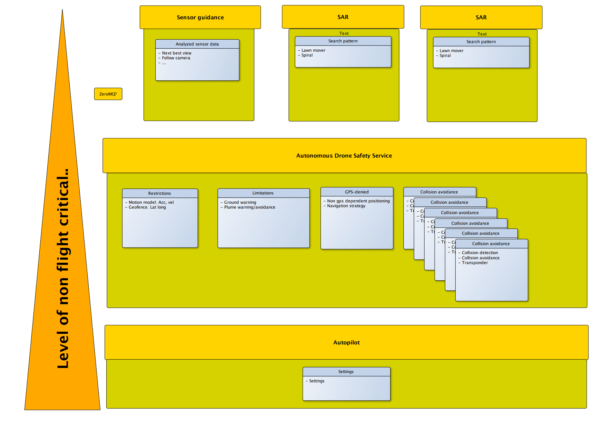

Requirements
============

Requirements introduction
-------------------------

This chapter lists requirements on the system and motivates why the
requirements are relevant.

Requirements
------------

System requirements
~~~~~~~~~~~~~~~~~~~

GCS software
  The system shall be possible to monitor and control via a GCS
  software, such as Mission Planner, QPlanner or similiar.
  Why? To
  monitor and control the flight in general is required for safe and
  effective flight.

Companion computer requirements
~~~~~~~~~~~~~~~~~~~~~~~~~~~~~~~

Flight critical levels
  The companion computer shall be built in modules with different
  flight critical levels. For modules with higher flight critical
  levels high demands on testing, documentation and routines on making
  changes. On modules with lower flight critical levels the demands
  are lower, because all commands generated in theses modules are sent
  throught the flight critical modules.

  Why? Be dividing different functionality in different modules a
  stable and safe baseline can be set and applications can be built
  and tested in an agile and development friendly manner.

.. |DSS| replace:: Drone Safety System

|DSS|
~~~~~

Overview
~~~~~~~~

|DSS| is a multi platform, multi autopilot and general application
service that ensures safe flight. The idea behind the service is to
take responsibility for all software related flight safety critical
components, enabling an agile approach in new application development.
|DSS| enables a filtered hence safe software route for aircraft
command and control from any application code. Using the |DSS| we can
use the "compile and fly" approach during development of new
applications wich enables a way for people not being experienced with
drones (or programming) to design code that safely flies the drone.

  A brief architecture overview

Architecture overview
~~~~~~~~~~~~~~~~~~~~~

The |DSS| is a block of several modules. The development of modules is
progressive - new modules are developed and tested as needed and
development of new modules will start off as applications and then
brought into the |DSS| when mature. As a result of initial discussion
and brainstorming a list of possible/suitable modules are presented
below.

**Restrictions**

  Static entities:

  * Vehicle limitation settings: Speed, acceleration, min alt, max
    alt, max radius etc.

  * Geofencing.

  * Topography.

**Limitations**

  Dynamic entities, typically dependent on sensor input: ??? Borde
  slås ihop med restrictions?

  * Ground warning.

  * High wind warning.

  * Smoke plume avoidance.

**GPS denied**

  A non GPS dependent method for positioning and navigation.

**Termination**

  A module that can terminate the flight in means of disabling the
  motors, enabling warning sound and if available shoot the parachute.

**Battery**

  The battery module enforces return to launch or land now based on
  distance to home and knowledge of the current battery status.

**Collision avoidance**

  * Mid air: Prevent collision with other aircraft using
    transponder/UTM and/or other sensors like camera, LIDAR, RADAR.

  * Air to ground: Prevent collision with ground/trees/buildings.

**Transponder/UTM**

  The transponder/UTM module handles communication with transponder
  and/or UTM-service.

**Diagnosis**

  Survey the health of flight critical sensor set. Diagnose problems
  and act/alert.

**Link control**

  Handles different types of link loss.

**Prediction**

  Predicts ETA, battery status etc.

Brain storming notes.

- Control
- Homing beacon
- Navigation
- Guidance
- Validation
- Route planning
- ..and more

Interfaces
----------

There are three interfaces to the |DSS|, two external directed to the
application code and one internal directed to the autopilot.

External inteface
~~~~~~~~~~~~~~~~~

The |DSS| offers two external interfaces or API towards the
application. To support any code base in the application, commands are
encoded in JSON objects and transferred via zeroMQ library.

There is one Request/Reply socket where the application can call
functions and receive ack/nack, there is also a Publish/Subscribe
socket where autopilot state data is streamed. Available commands are
described in :ref:`dssapi`.

.. %(\textcolor{red}{The list below is old and for reference only.}).
   % \begin{itemize}
   %   \item[]\textbf{goto(Lat, Long, Alt)}
   %   Go to GPS coordinate defined by Lat [decimal degrees], Long [decimal degrees], Alt [MSL]. (Down?)
   %   \item[]\textbf{set\_vel(vel\_x, vel\_y, vel\_d, yaw\_rate)}
   %   Set body fixed velocities. Velocities in [m/s], yaw\_rate in [degrees/s].
   %   \item[]\textbf{set\_alt(alt, [reference])}
   %   Set altitude, default reference is MSL, options for reference are AGL, MSL. AGL will maintain continue tracking set AGL as elevation changes.
   %   \item[]\textbf{set\_heading(yaw)}
   %   Set heading defined by heading [degrees].
   %   \item[]\textbf{wp\_list(wp1, [wp2, wp3,..])}
   %   Set wp list defined by wp[Lat, Long, ALT]. Altitude in MSL.
   %   \item[]\textbf{get\_list()}
   %   Get current waypoint list.
   % \end{itemize}

Internal interface
~~~~~~~~~~~~~~~~~~

The internal interface is built on the API of the open source package
Dronekit-python. The API communicates with vehicles over MAVLink. It
provides programmatic access to a connected vehicle’s telemetry, state
and parameter information, and enables both mission management and
direct control over vehicle movement and operations.

.. %For now only a brief overview of functionality is listed. The idea is to customize and use a subset of the available library (\textcolor{red}{TBD}). Some general topics are listed for now.
   %\begin{itemize}
   %  \item[]\textbf{Connect to vehicle}
   %  \item[]\textbf{Set state}
   %  \item[]\textbf{Setup telemetry}
   %  \item[]\textbf{Guide}
   %  \item[]\textbf{PL control}
   %  \item[]\textbf{Create/change mission}
   %  \item[]\textbf{Override RC-channels..}
   %\end{itemize}

Also central in the |DSS| is the DSSConfig.json-file. This file holds
aircraft specific limitations such as velocity limits and acceleration
limits (to be expanded). This file must be encoded in UTF-8.

.. code-block:: json
  :caption: DSSConfig.json

  {
  "VEL": {
    "vel_x_max": 5,
    "vel_x_min": -3,
    "vel_y_max": 3,
    "vel_y_min": -3,
    "vel_z_max": 1,
    "vel_z_min": -1.5
    },
  "ACC": {
    "acc_x": 0.5,
    "acc_y": 0.5,
    "acc_z": 0.2
    }
  }

There is a Settings.json-file that holds information about ip
adresses, ports etc. This file must be encoded in UTF-8.

.. code-block:: json
  :caption: Settings.json-file

  {
    "DSSServSocket": "tcp://*:5557",
    "DSSClientSocket": "tcp://localhost:5557",
    "DSSPubSocket": "tcp://*:5558",
    "DSSSubSocket": "tcp://192.168.2.2:5558",
    "GlanaClientSocket": "tcp://192.168.2.3:5562",
    "GlanaServSocket": "tcp://*:5562"
  }

Python code snippet to read the setting files

.. code-block:: python
  :caption: Python code snippet

  with open('DSSConfig.json', 'r', encoding='utf-8') as infile:
    DSSConfig = json.load(infile)
  vel_x_max = DSSConfig["VEL"]["vel_x_max"]
  print("Max x velocity, vel_x_max is:", vel_x_max)
