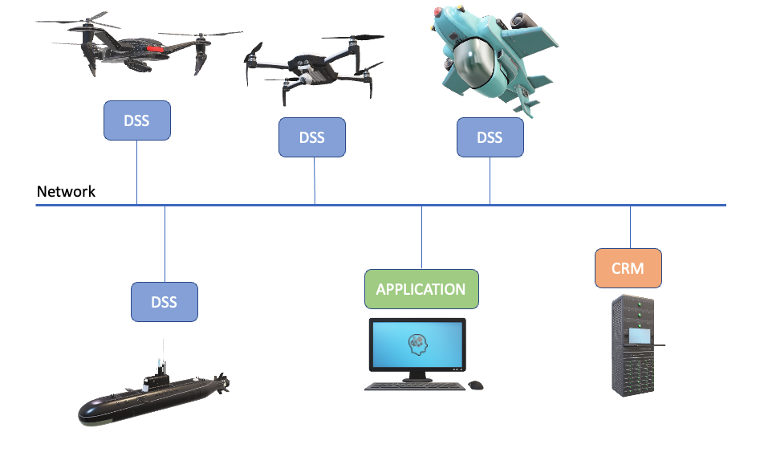

.. _introduction:

Introduction
============

============================ ===================
documentation                |version|
============================ ===================
companion_computer/ardupilot |version-ardupilot|
companion_computer/dji       |version-dji|
============================ ===================

Document History
----------------

See the table below for the :ref:`document history<document_history>`.

.. _document_history:
.. list-table:: Document history
  :widths: 15 25 60
  :header-rows: 1

  * - Revision
    - Release date
    - Affected chapters
  * - 0.0
    - 2019-01-10
    - Working copy
  * - 0.611
    - 2019-09-20
    - All sections
  * - 0.62
    - 2019-10-07
    - dssapi
  * - 0.631
    - 2019-10-16
    - dss-geo, user_set and id added
  * - 1.0
    - 2019-12-12
    - Clean up for release
  * - 1.01
    - 2020-02-12
    - Interactive map module first draft
  * - 1.02
    - 2020-04-24
    - Mission progress added to DSS API
  * - 1.03
    - 2020-09-24
    - Data streams added+topics
  * - 1.04
    - 2021-01-27
    - Typos and introduction
  * - 1.05
    - 2022-01-20 
    - Typos and clarifications

.. |DSS| replace:: Drone Safety System

Platform Overview
-----------------

This defines the RISE versatile drone software platform. The platform is general and built to develop different applicaitons, based on different robots and different needs. It is an appication enabler that makes it easy to get a sensor in the air or lay out an advanced search pattern and let an AI-based algorithm close the loop based on video data. 

First, lets shortly introduce the building blocks within the software platform.

.. glossary::
  
  Application
  
    A software component that utilizes one or several drones to execute missions. This software is typically built by the customer from a python template. The application code decides what control commands that should be sent to the drone and when, such as take-off, goto wp, take-photo etc. The application code can utilize the handy DSS-library or just implement the commands as they are described in the API. The application can run anywhere on the network; on the drone, on the server or why not as an mobile app.

  DSS
  
    Drone Safety Service (DSS), which is a component developed and maintained by RISE that acts as a bridge between applications and the autopilot. The DSS is a software that receives commands from applications (mainly from applications, but also from other modules), interprets them and tries to execute them through the autopilot. Currently there are two DSS versions, one for Ardupilot and one for DJI. Both DSS offer the same API, so on the application level the code is exactly the same. 

  CRM
  
    Central Resource Manager, a resource manager that runs in the network. The main responsibility for the CRM is to help applications to connect to a drone resource (i.e. DSS) from the pool of available drones. In very simple scenarios the application can connect directly to the DSS, but in scenarios that involve several applications and drones (i.e. several DSSs) a manual resource management quickly gets cumbersome. Using the CRM all clients, i.e. applications and DSSs, shall register to the CRM. CRM then automatically becomes the owner of the drone resources and thereafter it is up to negotiation about the resources. CRM is also responsible for sharing connection information between connected clients.

  Network

    We use VPN to gather all involved drone resources and applications on the same network and to handle the security in the system. We consider all clients in the network friendly. The VPN-service that is normally used is an OpenVPN-server hosted on a RISE server. OpenVPN is compatible with 'all' platforms, including mobile devices.
    

  Drone software platform overview

Communication
-------------
The drone software platform relies on the universal messaging library ZeroMQ [#f1]_. It is independent on code base and architecture, we use JSON formatted
messages for all communication as described in the APIs. 

Autopilots
----------
Currently there are two implementations of the DSS, one in python3 for Ardupilot, which preferably runs on a raspberry onboard the aircraft. The other implementation is an iOS-app written in Swift for DJI autopilots supporting the DJI Mobile SDK.
We strive to have the same compability for both autopilots, but that is not always the case. This document holds a compatibility matrix for each of
the two implementations for each DSS API-call.

APIs
----
The different building blocks have mandatory APIs, on top of that one can expand the API to what ever needs the specific application has. For example an application might need to be run as two processes. The second process we then call a support application.
In this document the different APIs are described. It is organized such as the module responding to a call owns the API, hence take-off command is described in DSS API, and requesting a drone from the drone pool is described in the CRM API.
Sockets and ports to use are also described in the beginning of each API chapter.

Prefered Work Flow
------------------

CRM offers services that are especially useful for multi-client scenarios. Although it can be used in scenarios with only one drone, and applications can be run without it.
The preferred work flow is however to use the CRM which can be run locally or on a server in the network. Including the CRM in the work flow ensures compability with system tools and makes expansion to multi-client scenarios much easier.

.. warning::
  Always simulate applications prior to flying (use the Ardupilot SITL or DJI
  simulator offered in the DSS app). Stay safe, fly at your own risk.

.. rubric:: Footnotes

.. [#f1] https://zeromq.org/
